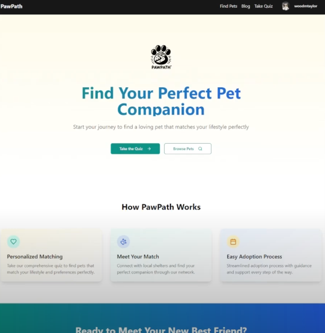

# PawPath 🐾

<div align="center">

  
  
</div>

**A comprehensive pet adoption platform connecting shelters, pets, and potential adopters through intelligent matching algorithms.**


[](https://php.net)
[](https://reactjs.org)
[](https://typescriptlang.org)
[](https://mysql.com)

## Features

### Core Functionality
- **Intelligent Pet Matching** - AI-powered quiz system that matches users with compatible pets
- **Shelter Management** - Complete shelter administration with pet inventory and application tracking
- **Adoption Applications** - Streamlined application process with document management
- **Multi-Role System** - Role-based access control for adopters, shelter staff, and administrators
- **Responsive Design** - Mobile-first approach with modern UI/UX

### Advanced Features
- **Quiz-Based Recommendations** - Comprehensive pet compatibility assessment
- **Favorites System** - Save and track preferred pets
- **Email Notifications** - Automated verification and status updates
- **Content Management** - Blog system with affiliate product integration
- **Secure Authentication** - JWT-based authentication with email verification
- **Analytics Dashboard** - Administrative insights and reporting

## Documentation

- **[Installation Guide](docs/INSTALLATION.md)**
- **[Architecture Overview](docs/ARCHITECTURE.md)**
- **[Database Schema](docs/DATABASE.md)**
- **[API Documentation](docs/API.md)**

## Repo Structure

```
pawpath-pet-adoption/
├── backend/               # PHP Backend
│   ├── public/            # Web server entry point
│   ├── src/               # Application source code
│   │   ├── api/           # API Controllers
│   │   ├── models/        # Data Models
│   │   ├── services/      # Business Logic
│   │   ├── middleware/    # Authentication & Authorization
│   │   └── config/        # Configuration
│   ├── database/          # Database migrations
│   ├── tests/             # Test suite
│   └── composer.json      # PHP dependencies
├── frontend/              # React Frontend
│   ├── src/               # Source code
│   │   ├── components/    # React Components
│   │   ├── pages/         # Page Components
│   │   ├── services/      # API Services
│   │   ├── types/         # TypeScript Definitions
│   │   └── assets/        # Static Assets
│   ├── public/            # Public assets
│   └── package.json       # Node.js dependencies
├── docs/                  # Documentation
└── README.md              
```
